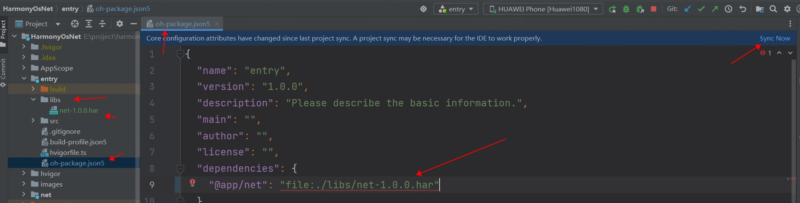
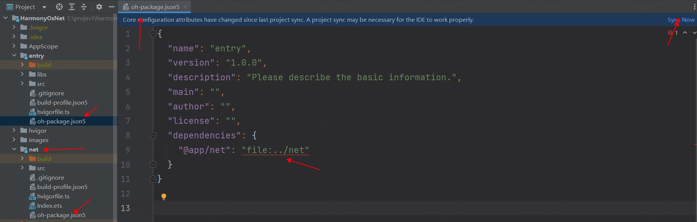
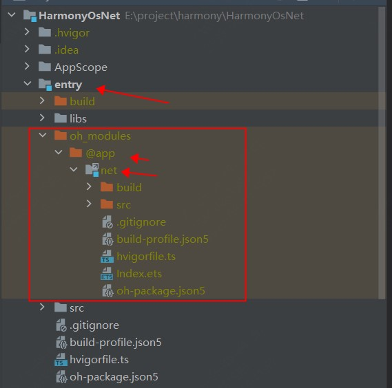

# HarmonyOsNet

<p align="center" style="font-size:12px;"><br/>扫一扫，查阅更多技术文章！</p>

### 介绍

**HarmonyOS网络库**，基于http封装而来，简化了请求方式，增加了常见的业务功能，支持同步、异步、装饰器模式，支持多种返回数据类型，Json、对象、数组，支持数据缓存，支持dialog加载，支持控制台请求信息格式化输出……

### 开发环境

DevEco Studio 4.0 Beta2,Build Version: 4.0.0.400

Api版本：9

hvigorVersion：3.0.2

### 主要功能点

<p align="center">当前版本：<i><span style="color:#ff0000;">1.0.0</span></i></p>

- [x] **支持全局初始化**
- [x] **支持统一的BaseUrl**
- [x] **支持全局错误拦截**
- [x] **支持全局头参拦截**
- [x] **支持同步方式请求（get/post/delete/put/options/head/trace/connect）**
- [x] **支持异步方式请求（get/post/delete/put/options/head/trace/connect）**
- [x] **支持装饰器方式请求（get/post/delete/put/options/head/trace/connect）**
- [x] **支持dialog加载**
- [x] **支持返回Json字符串**
- [x] **支持返回对象**
- [x] **支持返回数组**
- [x] **支持返回data一层数据**
- [x] **支持上传文件**
- [x] **支持下载文件**
- [ ] 数据缓存开发中……

### 快速使用

**私服和远程依赖**，由于权限和审核问题，预计需要等到2024年第一季度面向所有开发者，所以，只能使用**本地静态共享包**和**源码**
两种使用方式，本地静态共享包类似Android中的aar依赖，直接复制到项目中即可。

#### 1、本地静态共享包har包使用

<p>首先，下载har包，<a href="https://github.com/AbnerMing888/HarmonyOsNet/raw/master/net.har">点击下载</a></p>
<p>下载之后，把har包复制项目中，目录自己创建，如下，我创建了一个libs目录，复制进去</p>
<p></p>
<p>引入之后，进行同步项目，点击Sync Now即可，当然了你也可以，将鼠标放置在报错处会出现提示，在提示框中点击Run 'ohpm install'。</p>
<p>需要注意，<strong>@app/net</strong>，是用来区分目录的，可以自己定义，比如@aa/bb等，关于静态共享包的创建和使用，请查看如下我的介绍，这里就不过多介绍</p>

[HarmonyOS开发：走进静态共享包的依赖与使用](https://juejin.cn/post/7274982412245876776)

#### 2、源码直接使用

直接把net这个module复制到项目中，直接引用即可：

<p></p>

#### 3、查看是否引用成功

无论使用哪种方式进行依赖，最终都会在使用的模块中，生成一个oh_modules文件，并创建源代码文件，有则成功，无则失败，如下：

<p align="center"></p>

### 全局初始化

推荐在AbilityStage进行初始化，初始化一次即可，初始化参数可根据项目需要进行选择性使用。

```typescript
Net.getInstance().init({
  baseUrl: "https://www.vipandroid.cn", //设置全局baseurl
  connectTimeout: 10000, //设置连接超时
  readTimeout: 10000, //设置读取超时
  netErrorInterceptor: new MyNetErrorInterceptor(), //设置全局错误拦截,需要自行创建,可在这里进行错误处理
  netHeaderInterceptor: new MyNetHeaderInterceptor(), //设置全局头拦截器,需要自行创建
  header: {}, //头参数
  resultTag: []//接口返回数据参数，比如data,items等等
})
```

#### 初始化属性介绍

初始化属性，根据自己需要选择性使用。

| 属性                   | 类型                    | 概述                                |
|----------------------|-----------------------|-----------------------------------|
| baseUrl              | string                | 一般标记为统一的请求前缀，也就是域名                |
| connectTimeout       | number                | 连接超时，默认10秒                        |
| readTimeout          | number                | 读取超时，默认10秒                        |
| netErrorInterceptor  | INetErrorInterceptor  | 全局错误拦截器，需继承INetErrorInterceptor   |
| netHeaderInterceptor | INetHeaderInterceptor | 全局请求头拦截器，需继承INetHeaderInterceptor |
| header               | Object                | 全局统一的公共头参数                        |
| resultTag            | Array<string>         | 接口返回数据参数，比如data,items等等           |

#### 设置请求头拦截

关于全局头参数传递，可以通过以上的header参数或者在请求头拦截里均可。

名字自定义，实现INetHeaderInterceptor接口，可在netHeader方法里打印请求头或者追加请求头。

```typescript

import { HttpHeaderOptions, NetHeaderInterceptor } from '@app/net'

class MyNetHeaderInterceptor implements NetHeaderInterceptor {
  getHeader(options: HttpHeaderOptions): Promise<Object> {
    //可以进行接口签名，传入头参数
    return null
  }
}
```

#### 设置全局错误拦截器

名字自定义，实现INetErrorInterceptor接口，可在httpError方法里进行全局的错误处理，比如统一跳转，统一提示等。

```typescript
import { NetError } from '@app/net/src/main/ets/error/NetError';
import { INetErrorInterceptor } from '@app/net/src/main/ets/interceptor/INetErrorInterceptor';

export class MyNetErrorInterceptor implements INetErrorInterceptor {
  httpError(error: NetError) {
    //这里进行拦截错误信息

  }
}
```

#### NetError对象

可通过如下方法获取错误code和错误描述信息。

```
/*
   * 返回code
   * */
getCode():number{
  return this.code
}

/*
* 返回message
* */
getMessage():string{
  return this.message
}

```

### 异步请求

#### 1、请求说明

为了方便数据的针对性返回，目前异步请求提供了三种请求方法，在实际的
开发中，大家可以针对需要，选择性使用。

##### request方法

```typescript
Net.get("url").request<TestModel>((data) => {
  //data 就是返回的TestModel对象
})
```

此方法，针对性返回对应的data数据对象，如下json，则会直接返回需要的data对象，不会携带外层的code等其他参数，方便大家直接的拿到数据。

```json
{
  "code": 0,
  "message": "数据返回成功",
  "data": {}
}
```

如果你的data是一个数组，如下json:

```json
{
  "code": 0,
  "message": "数据返回成功",
  "data": []
}
```

数组获取

```typescript
Net.get("url").request<TestModel[]>((data) => {
  //data 就是返回的TestModel[]数组
})

//或者如下

Net.get("url").request<Array<TestModel>>((data) => {
  //data 就是返回的TestModel数组
})
```

可能大家有疑问，如果接口返回的json字段不是data怎么办？如下：

举例一

```json
{
  "code": 0,
  "message": "数据返回成功",
  "items": {}
}
```

举例二

```json
{
  "code": 0,
  "message": "数据返回成功",
  "models": {}
}
```

虽然网络库中默认取的是json中的data字段，如果您的数据返回类型字段有多种，如上json,可以通过全局初始化resultTag进行传递或者局部setResultTag传递即可。

**全局设置接口返回数据参数【推荐】**

全局设置，具体设置请查看上边的全局初始化一项，只设置一次即可，不管你有多少种返回参数，都可以统一设置。

```typescript
 Net.getInstance().init({
  resultTag: ["data", "items", "models"]//接口返回数据参数，比如data,items等等
})
```

**局部设置接口返回数据参数**

通过setResultTag方法设置即可。

```typescript
Net.get("")
  .setResultTag(["items"])
  .request<TestModel>((data) => {

  })
```

##### requestString方法

requestString就比较简单，就是普通的返回请求回来的json字符串。

```typescript
Net.get("url").requestString((data) => {
  //data 为 返回的json字符串
})
```

##### requestObject方法

requestObject方法也是获取对象，和request不同的是，它不用设置返回参数，因为它是返回的整个json对应的对象，
也就是包含了code，message等字段。

```typescript
Net.get("url").requestObject<TestModel>((data) => {
  //data 为 返回的TestModel对象
})
```

为了更好的复用共有字段，你可以抽取一个基类，如下：

```typescript
export class ApiResult<T> {
  code: number
  message: string
  data: T
}
```

以后就可以如下请求：

```typescript
Net.get("url").requestObject<ApiResult<TestModel>>((data) => {
  //data 为 返回的ApiResult对象
})
```

##### 回调函数

回调函数有两个，一个成功一个失败，成功回调必调用，失败可选择性调用。

只带成功

```typescript
Net.get("url").request<TestModel>((data) => {
  //data 为 返回的TestModel对象
})
```

成功失败都带

```typescript
Net.get("url").request<TestModel>((data) => {
  //data 为 返回的TestModel对象
}, (error) => {
  //失败
})
```

#### 2、get请求

```typescript
 Net.get("url").request<TestModel>((data) => {
  //data 为 返回的TestModel对象
})
```

#### 3、post请求

```typescript
Net.post("url").request<TestModel>((data) => {
  //data 为 返回的TestModel对象
})
```

#### 4、delete请求

```typescript
 Net.delete("url").request<TestModel>((data) => {
  //data 为 返回的TestModel对象
})
```

#### 5、put请求

```typescript
Net.put("url").request<TestModel>((data) => {
  //data 为 返回的TestModel对象
})
```

#### 6、其他请求方式

除了常见的请求之外，根据系统api所提供的，也封装了如下的请求方式,只需要更改请求方式即可，比如Net.options

```
OPTIONS
HEAD
TRACE
CONNECT
```

#### 7、各个方法调用

| 方法                        | 类型                            | 概述                      |
|---------------------------|-------------------------------|-------------------------|
| setHeaders                | Object                        | 单独添加请求头参数               |
| setBaseUrl                | string                        | 单独替换BaseUrl             |
| setParams                 | string / Object / ArrayBuffer | 单独添加参数,用于post           |
| setConnectTimeout         | number                        | 单独设置连接超时                |
| setReadTimeout            | number                        | 单独设置读取超时                |
| setExpectDataType         | http.HttpDataType             | 设置指定返回数据的类型             |
| setUsingCache             | boolean                       | 使用缓存,默认为true            |
| setPriority               | number                        | 设置优先级 默认为1              |
| setUsingProtocol          | http.HttpProtocol             | 协议类型默认值由系统自动指定          |
| setResultTag              | Array<string>                 | 接口返回数据参数，比如data,items等等 |
| setContext                | Context                       | 设置上下文,用于下载文件            |
| setCustomDialogController | CustomDialogController        | 传递的dialog控制器，用于展示dialog |

代码调用如下：

```typescript
Net.get("url")
  .setHeaders({})//单独添加请求头参数
  .setBaseUrl("")//单独替换BaseUrl
  .setParams({})//单独添加参数
  .setConnectTimeout(10000)//单独设置连接超时
  .setReadTimeout(10000)//单独设置读取超时
  .setExpectDataType(http.HttpDataType.OBJECT)//设置指定返回数据的类型
  .setUsingCache(true)//使用缓存,默认为true
  .setPriority(1)//设置优先级 默认为1
  .setUsingProtocol(http.HttpProtocol.HTTP1_1)//协议类型默认值由系统自动指定
  .setResultTag([""])//接口返回数据参数，比如data,items等等
  .setContext(this.context)//设置上下文,用于上传文件和下载文件
  .setCustomDialogController()//传递的dialog控制器，用于展示dialog
  .request<TestModel>((data) => {
    //data 为 返回的TestModel对象
  })
```

### 同步请求

同步请求需要注意，需要await关键字和async关键字结合使用。

```typescript
private async getTestModel(){
  const testModel = await Net.get("url").returnData<TestModel>()
}
```

#### 1、请求说明

同步请求和异步请求一样，也是有三种方式，是通过参数的形式，默认直接返回data层数据。

##### 返回data层数据

和异步种的request方法类似，只返回json种的data层对象数据，不会返回code等字段。

```typescript
 private async getData(){
  const data = await Net.get("url").returnData<TestModel>()
  //data为 返回的 TestModel对象
}
```

##### 返回Json对象

和异步种的requestObject方法类似，会返回整个json对象，包含code等字段。

```typescript
 private async getData(){
  const data = await Net.get("url").returnData<TestModel>(ReturnDataType.OBJECT)
  //data为 返回的 TestModel对象
}
```

##### 返回Json字符串

和异步种的requestString方法类似。

```typescript
private async getData(){
  const data = await Net.get("url").returnData<string>(ReturnDataType.STRING)
  //data为 返回的 json字符串
}
```

##### 返回错误

异步方式有回调错误，同步方式如果发生错误，也会直接返回错误，结构如下：

```json
{
  "code": 0,
  "message": "错误信息"
}
```

除了以上的错误捕获之外，你也可以全局异常捕获，

#### 2、get请求

```typescript

const data = await Net.get("url").returnData<TestModel>()

```

#### 3、post请求

```typescript

const data = await Net.post("url").returnData<TestModel>()

```

#### 4、delete请求

```typescript

const data = await Net.delete("url").returnData<TestModel>()

```

#### 5、put请求

```typescript

const data = await Net.put("url").returnData<TestModel>()

```

#### 6、其他请求方式

除了常见的请求之外，根据系统api所提供的，也封装了如下的请求方式,只需要更改请求方式即可，比如Net.options

```
OPTIONS
HEAD
TRACE
CONNECT
```

#### 7、各个方法调用

| 方法                        | 类型                            | 概述                      |
|---------------------------|-------------------------------|-------------------------|
| setHeaders                | Object                        | 单独添加请求头参数               |
| setBaseUrl                | string                        | 单独替换BaseUrl             |
| setParams                 | string / Object / ArrayBuffer | 单独添加参数,用于post           |
| setConnectTimeout         | number                        | 单独设置连接超时                |
| setReadTimeout            | number                        | 单独设置读取超时                |
| setExpectDataType         | http.HttpDataType             | 设置指定返回数据的类型             |
| setUsingCache             | boolean                       | 使用缓存,默认为true            |
| setPriority               | number                        | 设置优先级 默认为1              |
| setUsingProtocol          | http.HttpProtocol             | 协议类型默认值由系统自动指定          |
| setResultTag              | Array<string>                 | 接口返回数据参数，比如data,items等等 |
| setContext                | Context                       | 设置上下文,用于下载文件            |
| setCustomDialogController | CustomDialogController        | 传递的dialog控制器，用于展示dialog |

代码调用如下：

```typescript
const data = await Net.get("url")
  .setHeaders({})//单独添加请求头参数
  .setBaseUrl("")//单独替换BaseUrl
  .setParams({})//单独添加参数
  .setConnectTimeout(10000)//单独设置连接超时
  .setReadTimeout(10000)//单独设置读取超时
  .setExpectDataType(http.HttpDataType.OBJECT)//设置指定返回数据的类型
  .setUsingCache(true)//使用缓存,默认为true
  .setPriority(1)//设置优先级 默认为1
  .setUsingProtocol(http.HttpProtocol.HTTP1_1)//协议类型默认值由系统自动指定
  .setResultTag([""])//接口返回数据参数，比如data,items等等
  .setContext(this.context)//设置上下文,用于上传文件和下载文件
  .setCustomDialogController()//传递的dialog控制器，用于展示dialog
  .returnData<TestModel>()
//data为 返回的 TestModel对象
```

### 装饰器请求

网络库允许使用装饰器的方式发起请求，也就是通过注解的方式，目前采取的是装饰器方法的形式。

#### 1、请求说明

装饰器和同步异步有所区别，只返回两种数据类型，一种是json字符串，一种是json对象，暂时不提供返回data层数据。
在使用的时候，您可以单独创建工具类或者ViewModel或者直接使用，都可以。

##### 返回json字符串

```typescript
@GET("url")
private getData():Promise<string> {
  return null
}
```

##### 返回json对象

```typescript
@GET("url")
private getData():Promise<TestModel> {
  return null
}
```

#### 2、get请求

```typescript
@GET("url")
private getData():Promise<TestModel> {
  return null
}
```

#### 3、post请求

```typescript
@POST("url")
private getData():Promise<TestModel> {
  return null
}
```

#### 4、delete请求

```typescript
@DELETE("url")
private getData():Promise<TestModel> {
  return null
}
```

#### 5、put请求

```typescript
@PUT("url")
private getData():Promise<TestModel> {
  return null
}
```

#### 6、其他请求方式

除了常见的请求之外，根据系统api所提供的，也封装了如下的请求方式,只需要更改请求方式即可，比如@OPTIONS

```
OPTIONS
HEAD
TRACE
CONNECT
```

当然，大家也可以使用统一的NET装饰器，只不过需要自己设置请求方法，代码如下：

```typescript
@NET("url", { method: http.RequestMethod.POST })
private getData():Promise<string> {
  return null
}
```

#### 7、装饰器参数传递

##### 直接参数传递

直接参数，在调用装饰器请求时，后面添加即可,一般针对固定参数。

```typescript
@GET("url", {
  baseUrl: "", //baseUrl
  header: {}, //头参数
  params: {}, //入参
  connectTimeout: 1000, //连接超时
  readTimeout: 1000, //读取超时
  isReturnJson: true//默认false 返回Json字符串,默认返回json对象
})
private getData():Promise<string> {
  return null
}
```

##### 动态参数传递

动态参数适合参数可变的情况下传递，比如分页等情况。

```typescript
@GET("url")
private getData(data? : HttpOptions):Promise<string> {
  return null
}
```

调用时传递

```typescript
private async doHttp(){
  const data = await this.getData({
    baseUrl: "", //baseUrl
    header: {}, //头参数
    params: {}, //入参
    connectTimeout: 1000, //连接超时
    readTimeout: 1000, //读取超时
    isReturnJson: true//默认false 返回Json字符串,默认返回json对象
  })
}
```

##### 装饰器参数传递

使用DATA装饰器，DATA必须在上！

```typescript
@DATA({
  baseUrl: "", //baseUrl
  header: {}, //头参数
  params: {}, //入参
  connectTimeout: 1000, //连接超时
  readTimeout: 1000, //读取超时
  isReturnJson: true//默认false 返回Json字符串,默认返回json对象
})
@GET("url")
private getData():Promise<string> {
  return null
}
```

### 上传下载

#### 1、上传文件

```typescript
Net.uploadFile("")//上传的地址
  .setUploadFiles([])//上传的文件 [{ filename: "test", name: "test", uri: "internal://cache/test.jpg", type: "jpg" }]
  .setUploadData([])//上传的参数 [{ name: "name123", value: "123" }]
  .setProgress((receivedSize, totalSize) => {
    //监听上传进度
  })
  .request((data) => {
    if (data == UploadTaskState.COMPLETE) {
      //上传完成
    }
  })
```

##### 方法介绍

| 方法             | 类型     | 概述                                                                 |
|----------------|--------|--------------------------------------------------------------------|
| uploadFile     | string | 上传的地址                                                              |
| setUploadFiles | Array  | 上传的文件数组                                                            |
| setUploadData  | Array  | 上传的参数数组                                                            |
| setProgress    | 回调函数   | 监听进度，receivedSize下载大小， totalSize总大小                                |
| request        | 无      | 请求上传，data类型为UploadTaskState，有三种状态：START(开始),COMPLETE(完成),ERROR(错误) |

##### 其他方法

删除上传进度监听

```typescript
uploadRequest.removeProgressCallback()
```

删除上传任务

```typescript
uploadRequest.deleteUploadTask((result) => {
  if (result) {
    //成功
  } else {
    //失败
  }
})
```

#### 2、下载文件

```typescript
Net.downLoadFile("http://10.47.24.237:8888/harmony/log.har")
  .setContext(EntryAbility.context)
  .setFilePath(EntryAbility.filePath)
  .setProgress((receivedSize, totalSize) => {
    //监听下载进度
  })
  .request((data) => {
    if (data == DownloadTaskState.COMPLETE) {
      //下载完成
    }
  })
```

##### 方法介绍

| 方法           | 类型      | 概述                                                                              |
|--------------|---------|---------------------------------------------------------------------------------|
| downLoadFile | string  | 下载的地址                                                                           |
| setContext   | Context | 上下文                                                                             |
| setFilePath  | string  | 下载后保存的路径                                                                        |
| setProgress  | 回调函数    | 监听进度，receivedSize下载大小， totalSize总大小                                             |
| request      | 无       | 请求下载，data类型为DownloadTaskState，有四种状态：START(开始),COMPLETE(完成),PAUSE(暂停),REMOVE(结束) |

##### 其他方法

移除下载的任务

```typescript
    downLoadRequest.deleteDownloadTask((result) => {
  if (result) {
    //移除成功
  } else {
    //移除失败
  }
})
```

暂停下载任务

```typescript
downLoadRequest.suspendDownloadTask((result) => {
  if (result) {
    //暂停成功
  } else {
    //暂停失败
  }
})
```

重新启动下载任务

```typescript
downLoadRequest.restoreDownloadTask((result) => {
  if (result) {
    //成功
  } else {
    //失败
  }
})
```

删除监听下载进度

```typescript
downLoadRequest.removeProgressCallback()
```

### Dialog加载

<p align="center"></p>

#### 1、定义dialog控制器

NetLoadingDialog是net包中自带的，菊花状弹窗，如果和实际业务不一致，可以更换。

```
private mCustomDialogController = new CustomDialogController({
  builder: NetLoadingDialog({
    loadingText: '请等待...'
  }),
  autoCancel: false,
  customStyle: true
})
```

#### 2、调用传递控制器方法

此方法会自动显示和隐藏dialog，如果觉得不合适，大家可以自己定义即可。

```typescript
setCustomDialogController(this.mCustomDialogController)
```

### 注意事项

目前仍然在持续优化更新中，更多功能，大家敬请期待，有任何问题，大家都可以提issues。

### 欢迎关注作者

微信搜索【App开发干货铺】，或扫描下面二维码关注，查阅更多技术文章！


### 赞赏作者

看在作者这么努力的份上，微信赞赏随意，给个鼓励好不好~


### License

```
Copyright (C) AbnerMing, HarmonyOsNet Open Source Project

Licensed under the Apache License, Version 2.0 (the "License");
you may not use this file except in compliance with the License.
You may obtain a copy of the License at

     http://www.apache.org/licenses/LICENSE-2.0

Unless required by applicable law or agreed to in writing, software
distributed under the License is distributed on an "AS IS" BASIS,
WITHOUT WARRANTIES OR CONDITIONS OF ANY KIND, either express or implied.
See the License for the specific language governing permissions and
limitations under the License.
```


